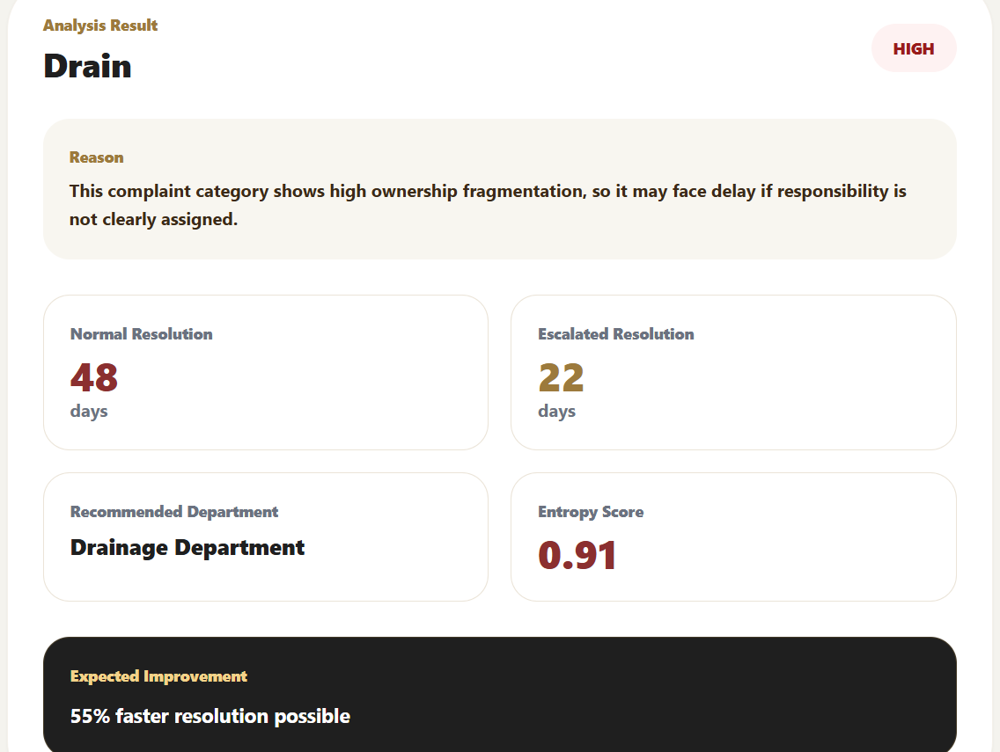
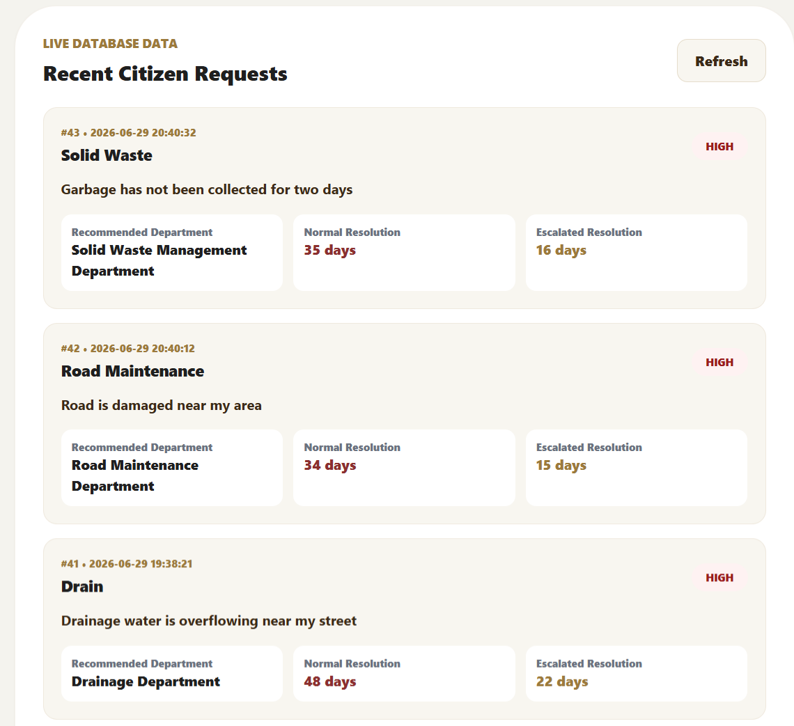
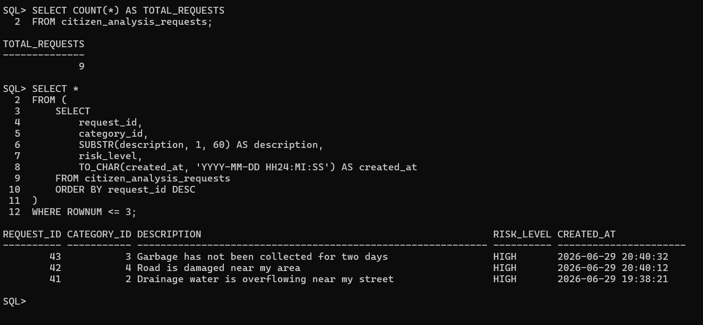

# Mandate Vacuum – Governance Intelligence System

**A full-stack application that identifies why municipal complaints get delayed and recommends the right department for faster resolution.**

🌐 [Live Analytical Dashboard](https://visha-l127.github.io/mandate-vacuum-governance-intelligence) · ⚙️ React + Spring Boot + Oracle · 📊 3,026 BBMP complaints analyzed

---

## Important Note

The live dashboard link shows the original deployed analytical frontend.

This repository contains the upgraded full-stack version with:

* Spring Boot REST APIs
* Oracle Database persistence
* Real-time complaint analysis flow
* Recent request history from database
* Full-stack proof screenshots

The full-stack backend and Oracle database currently run locally.

---

## Overview

Citizens file complaints about drainage, roads, garbage collection, electricity, and public health issues. Many complaints get delayed because no single department clearly owns the problem.

**Mandate Vacuum** detects these responsibility gaps using governance metrics such as ownership entropy, accountability decay, and resolution improvement estimates.

The project started as an analytical dashboard and was upgraded into a working full-stack prototype.

---

## What Is Built

| Module              | What It Does                                                               |
| ------------------- | -------------------------------------------------------------------------- |
| React Dashboard     | Displays civic complaint risk, delay, and ownership metrics                |
| Citizen Portal      | Allows users to submit a complaint and receive analysis                    |
| Spring Boot Backend | Processes complaint analysis through REST APIs                             |
| Oracle Database     | Stores departments, metrics, and complaint analysis requests               |
| Recent Requests     | Fetches saved complaint submissions from Oracle and displays them in React |

---

## Proof It Works

### 1. Complaint Analysis Result



A submitted drainage complaint is analyzed and converted into governance intelligence:

* Risk Level: **HIGH**
* Recommended Department: **Drainage Department**
* Normal Resolution Estimate: **48 days**
* Escalated Resolution Estimate: **22 days**
* Entropy Score: **0.91**
* Expected Improvement: **55% faster handling under clearer ownership**

---

### 2. Oracle-Backed Recent Requests



Submitted complaint analysis requests are stored in Oracle Database and fetched back into the React frontend.

This proves the full-stack flow:

```txt
React Frontend → Spring Boot API → Oracle Database → React Display
```

---

### 3. Oracle Database Verification



SQLPlus verification confirms that submitted complaint analysis requests are persisted in the `citizen_analysis_requests` table.

Example verification queries:

```sql
SELECT COUNT(*) FROM citizen_analysis_requests;

SELECT *
FROM (
    SELECT 
        request_id,
        category_id,
        SUBSTR(description, 1, 60) AS description,
        risk_level,
        TO_CHAR(created_at, 'YYYY-MM-DD HH24:MI:SS') AS created_at
    FROM citizen_analysis_requests
    ORDER BY request_id DESC
)
WHERE ROWNUM <= 3;
```

---

## Real Data Baseline

The project uses **3,026 BBMP civic complaint records** as the analytical baseline.

| Category         | Entropy | Risk | Normal Resolution | Escalated Resolution |
| ---------------- | ------: | ---- | ----------------: | -------------------: |
| Electrical       |    0.98 | HIGH |            9 days |               4 days |
| Drain            |    0.91 | HIGH |           48 days |              22 days |
| Road Maintenance |    1.00 | HIGH |           34 days |              15 days |
| Solid Waste      |    0.99 | HIGH |           35 days |              16 days |
| Forest           |    0.98 | HIGH |           31 days |              22 days |
| Health           |    1.00 | HIGH |           38 days |              27 days |

The simulator shows that clearer department ownership can reduce estimated resolution time in high-fragmentation categories.

---

## Core Features

* Complaint category analysis
* Risk level detection
* Department recommendation
* Normal vs escalated resolution estimate
* Ownership entropy score
* Expected improvement percentage
* Oracle-backed recent request history
* REST API integration between frontend and backend

---

## Architecture

```txt
┌─────────────────────┐
│  React Frontend     │
│  Citizen Portal     │
└──────────┬──────────┘
           │ REST API Calls
           ↓
┌─────────────────────┐
│  Spring Boot Backend│
│  Port 8081          │
│  Business Logic     │
└──────────┬──────────┘
           │ Spring JDBC
           ↓
┌─────────────────────┐
│  Oracle Database    │
│  8 Tables           │
│  Data Persistence   │
└─────────────────────┘
```

---

## Tech Stack

| Layer     | Technology                                    |
| --------- | --------------------------------------------- |
| Frontend  | React, TypeScript, Tailwind CSS, Vite         |
| Backend   | Java 17, Spring Boot, Spring Web, Spring JDBC |
| Database  | Oracle 11g Express Edition                    |
| Analysis  | Python, Pandas, NumPy, Jupyter                |
| API Style | REST APIs                                     |

---

## Database Tables

```txt
data_source_batches
departments
complaint_categories
historical_complaints
complaint_transfers
category_department_ownership
category_metrics
citizen_analysis_requests
```

The main real-time table is:

```txt
citizen_analysis_requests
```

It stores complaint analysis requests submitted from the React frontend.

---

## API Endpoints

| Method | Endpoint                      | Purpose                           |
| ------ | ----------------------------- | --------------------------------- |
| GET    | `/api/test-db`                | Tests Oracle connection           |
| GET    | `/api/metrics`                | Fetches all governance metrics    |
| GET    | `/api/metrics/{categoryCode}` | Fetches metrics by category       |
| POST   | `/api/citizen/analyze`        | Analyzes a citizen complaint      |
| GET    | `/api/citizen/requests`       | Fetches recent submitted requests |

Example complaint analysis request:

```json
{
  "categoryCode": "DRAIN",
  "description": "Drainage water is overflowing near my street",
  "language": "en"
}
```

---

## How to Run Locally

### 1. Start Backend

```cmd
cd backend
mvnw.cmd spring-boot:run
```

Backend runs on:

```txt
http://localhost:8081
```

Test backend:

```txt
http://localhost:8081/api/test-db
```

---

### 2. Start Frontend

```cmd
cd frontend
npm install
npm run dev
```

Frontend commonly runs on:

```txt
http://localhost:5173/mandate-vacuum-governance-intelligence/
```

or:

```txt
http://localhost:3000/mandate-vacuum-governance-intelligence/
```

---

### 3. Set Up Database

```sql
@database/schema.sql
@database/insert_data.sql
```

If the database is already set up, do not run `insert_data.sql` again to avoid duplicate seed data.

---

## Validation

* 3,026 BBMP civic complaint records used as analytical baseline
* Backend connected to Oracle successfully
* Metrics API returns all 6 civic complaint categories
* Complaint submission tested end-to-end
* Submitted requests are stored in Oracle Database
* Recent requests are fetched from Oracle and displayed in React
* Core REST APIs tested locally

---

## Limitations

* Full-stack backend currently runs locally
* Oracle database runs locally
* No login or authentication yet
* No live BBMP API integration yet
* No trained ML prediction model yet
* Current intelligence is based on analytical metrics, rules, and stored governance data
* Counterfactual results are estimated, not guaranteed real-world outcomes

---

## Next Steps

* Deploy backend and database
* Add department login
* Add ML-based complaint text classification
* Add live municipal dataset integration
* Add department escalation workflow
* Expand to multiple municipalities

---

## Author

**Vishal S.R**
B.Tech Information Technology
Karpagam College of Engineering
GitHub: [@visha-l127](https://github.com/visha-l127)

---

> Most system failures are not people failures. They are structure failures. Fix the structure.
