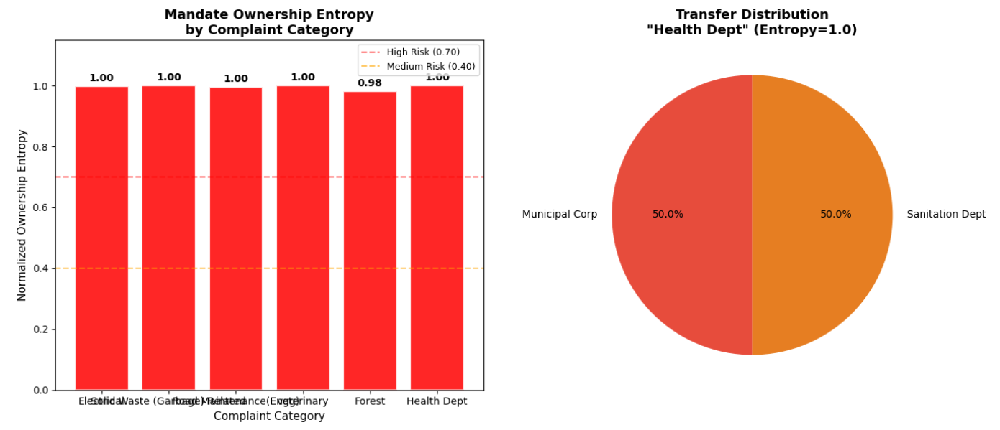
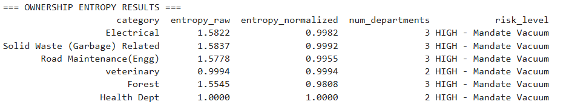
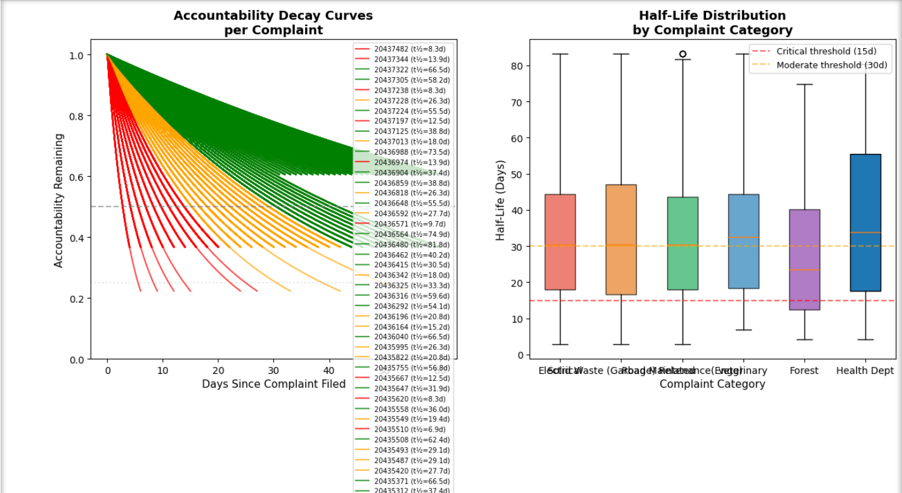
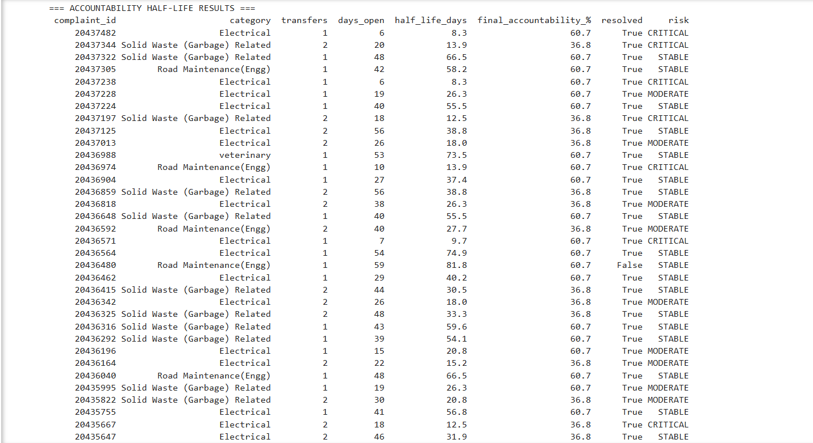
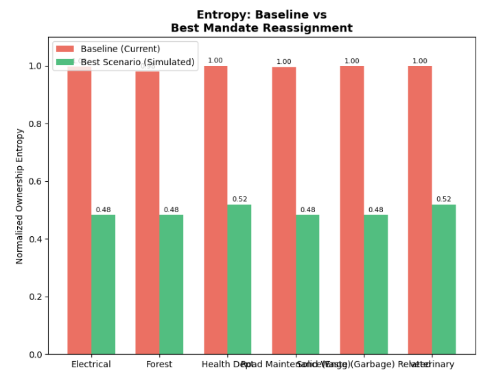
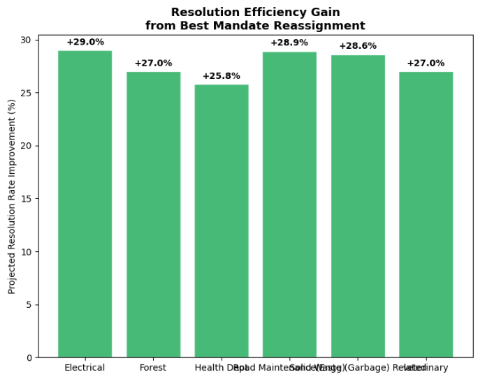

# Mandate Vacuum

**A mathematical diagnosis of why municipal complaint systems structurally fail.**

🌐 [Live Dashboard](https://visha-l127.github.io/mandate-vacuum-governance-intelligence) · 📖 [Understanding Entropy](./WHY_ENTROPY.md) · 📋 [Methodology](./METHODOLOGY.md) · ⚠️ [Limitations](./LIMITATIONS.md)

---

## Full-Stack Version Available

This repository contains the original deployed analytical dashboard of Mandate Vacuum.

A newer full-stack version has been developed with:

* Spring Boot REST APIs
* Oracle Database
* Citizen complaint persistence
* Recent request history
* Full-stack proof screenshots

Full-stack repository: [Mandate Vacuum Full-Stack](https://github.com/visha-l127/mandate-vacuum-fullstack)

---

## The Problem

Complaints bounce between departments. 6 weeks later: unresolved. No one owns it.

**Root cause:** Mandate boundaries between departments are unclear. When multiple departments can say "this isn't my responsibility," complaints disappear.

**This project:** Diagnoses structural ownership gaps using information theory. Quantifies the impact. Proposes fixes.

---

## Real Data Analysis

3,026 actual BBMP complaints analyzed.

**Key finding:** All 6 analyzed complaint categories exhibited high ownership fragmentation (entropy ≥ 0.98)

**With unified mandates:** Projected resolution efficiency improvements of 25–29%

---

## Analytical Outputs

### Ownership Entropy Analysis



High entropy = fragmented ownership = slower resolution



---

### Accountability Decay Modeling



Each department transfer → responsibility erodes exponentially. Half-life: 28–38 days.



---

### Counterfactual Governance Simulation



**Scenario: What if we unified mandate ownership?**



**Result:** 25–29% projected resolution efficiency improvement across all complaint types.

---

## The Math (Three Core Metrics)

**1. Ownership Entropy**
Measures how fragmented departmental ownership is for a complaint type.
- 0.0–0.3 = Clear owner ✅
- 0.7–1.0 = Fragmented (mandate vacuum) 🔴

Formula: `H = -Σ p(i) × log₂(p(i))`

**2. Accountability Half-Life**
Models how quickly responsibility decays as complaints transfer between departments.
- Each transfer = exponential loss, not linear
- Reflects real-world diffusion of accountability

Formula: `R(t) = R₀ × e^(-λt)`

**3. Counterfactual Simulator**
Isolates impact of mandate reassignment: "If primary ownership were unified, what efficiency improvement?"

---

## What's Built

**Analysis Layer** (Python)
Jupyter notebooks computing entropy, decay, counterfactual simulations from real municipal complaint data.

**Dashboard** (React + TypeScript)
Bilingual (English/Tamil) interactive interface:
- Vacuums: Entropy scores by category
- Decay: Half-life accountability curves
- Simulator: Governance policy scenarios
- Insights: AI-synthesized recommendations (Gemini API)

**Status:** Functional analytical prototype validated on real municipal complaint data.

---

## Tech Stack

| Layer | Technology |
|---|---|
| Frontend | React, TypeScript, Vite, Tailwind |
| Analysis | Python, Pandas, NumPy |
| AI | Google Gemini API |
| Deploy | GitHub Pages |

---

## Data Pipeline

```
Real BBMP Complaints (CSV)
    ↓
Clean & validate
    ↓
Calculate entropy per category
    ↓
Model accountability decay
    ↓
Simulate mandate restructuring
    ↓
React dashboard (interactive)
    ↓
GitHub Pages (live deployment)
```

---

## Why This Approach

| Aspect | Traditional System | Mandate Vacuum |
|---|---|---|
| Question | "Where is my complaint?" | "Why won't it resolve?" |
| Focuses on | Operational efficiency | Structural ownership |
| For | Citizens | Policy makers |

---

## Validation

✅ Analyzed 3,026 real BBMP complaints  
✅ Higher entropy categories showed longer average resolution times in the dataset  
✅ Model outputs tested against actual complaint patterns  
✅ Interactive dashboard deployed and functional  

---

## Known Limitations

- Decay model uses heuristic coefficients, not empirically calibrated
- Entropy assumes complaint independence (seasonal patterns not modeled)
- Cannot distinguish legitimate inter-department handoffs from accountability diffusion
- Counterfactual projections are theoretical (real-world implementation may vary)

See [LIMITATIONS.md](./LIMITATIONS.md) for complete scope.

---

## Running Locally

```bash
git clone https://github.com/visha-l127/mandate-vacuum-governance-intelligence.git
cd mandate-vacuum-governance-intelligence

# Analysis
pip install -r requirements.txt
jupyter notebook

# Dashboard
npm install --legacy-peer-deps
npm run dev
```

Add Gemini API key to `.env` for live AI insights.

---

## What This Taught Me

Governance failures are usually structural, not operational. Process improvements won't solve problems rooted in unclear mandate boundaries. This project is a diagnostic tool for identifying where structural reform is needed.

---

## Next Steps

- [ ] Empirically validate decay model against actual resolution outcomes
- [ ] Develop category-specific accountability coefficients
- [ ] Expand to other municipalities
- [ ] Build API for municipality data integration

---

## Author

**Vishal S.R** — [@visha-l127](https://github.com/visha-l127)

---

*"Most systems problems aren't people problems. They're structure problems."*

